# Flutter 开发环境搭建指南（mac）

以 Mac 为例，从零搭建 Flutter 开发环境的完整步骤。

**整体流程**（按顺序做，不容易乱）：


---

## 目录

| 章节 | 内容概要 |
|------|----------|
| [一、系统要求](#一系统要求) | macOS 版本、磁盘、基础工具 |
| [二、iOS 环境（Xcode + CocoaPods）](#二ios-环境xcode--cocoapods) | 安装 Xcode（上架需 ≥16）、命令行工具、CocoaPods |
| [三、Flutter SDK（鸿蒙版）](#三flutter-sdk鸿蒙版) | 下载/克隆、配置 PATH、验证 |
| [四、运行 Flutter Doctor](#四运行-flutter-doctor) | 环境自检与修复建议 |
| [五、鸿蒙（OpenHarmony）环境](#五鸿蒙openharmony环境) | 鸿蒙版 Flutter（AtomGit）、DevEco、构建 HAP |
| [六、Android 环境（可选）](#六android-环境可选) | JDK 17、Android Studio、SDK、许可 |
| [七、IDE 配置](#七ide-配置) | VS Code / Android Studio 与 Flutter 插件 |
| [八、常用命令&项目运行](#八常用命令速查) | doctor、run、build、鸿蒙 HAP 等 |
| [九、自检清单](#九自检清单) | 上架/开发前逐项核对 |
| [十、常见问题](#十常见问题) | 报错与排查 |

---

## 一、系统要求

**本节说明**：确认 Mac 满足最低要求后再进行后续安装。

---

- **操作系统**：macOS 10.14 (Mojave) 或更高
- **磁盘空间**：本文档覆盖 **iOS、Android、鸿蒙** 三端开发，建议预留 **80 GB 以上**。Xcode、Android Studio、DevEco、各端 SDK 与模拟器/镜像、构建缓存等会持续占用空间，实际需求往往更高。
- **工具**：bash、curl、git、mkdir、rm、unzip、which、zip 等（macOS 通常已自带）

---

## 二、iOS 环境（Xcode + CocoaPods）

**本节说明**：开发或上架 iOS 应用需要 Xcode 与 CocoaPods；上架 App Store 需 Xcode 16 及以上。
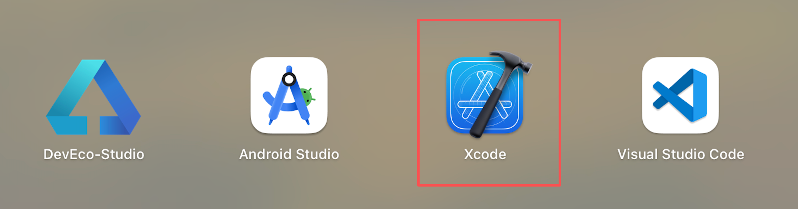

1. 从 **App Store** 安装 **Xcode**。
   - **上架 App Store 要求**：需使用 **Xcode 16 及以上版本**，否则可能无法提交或通过审核。
2. 安装完成后，打开 Xcode 一次，完成许可协议与额外组件安装(主要是安装模拟器)。
3. 启动 Xcode 创建一个app进行测试：
   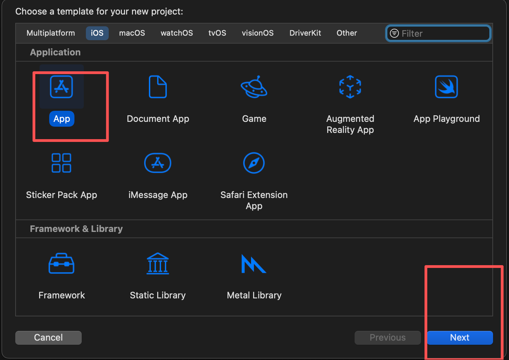
   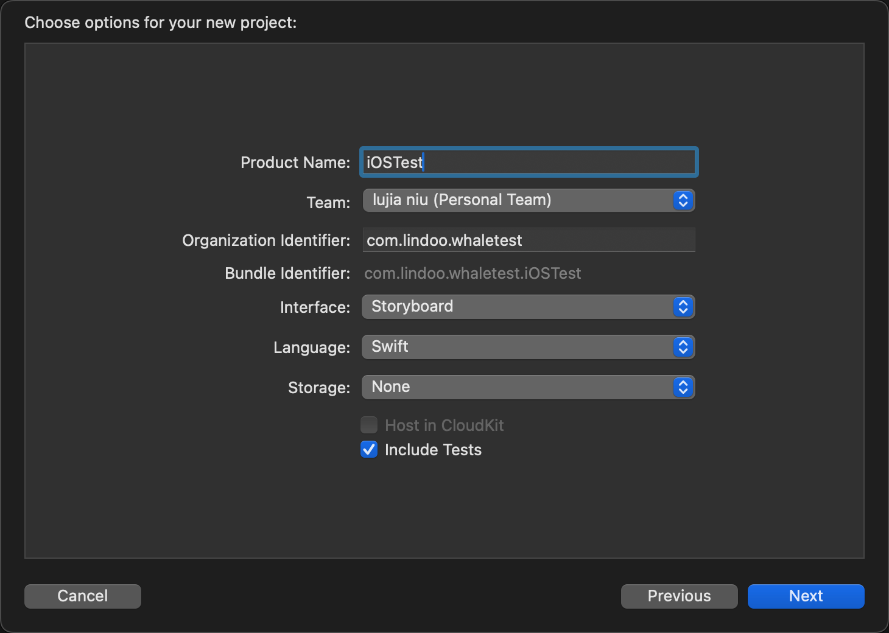
4. 运行 Xcode 选择模拟器查看加载效果：
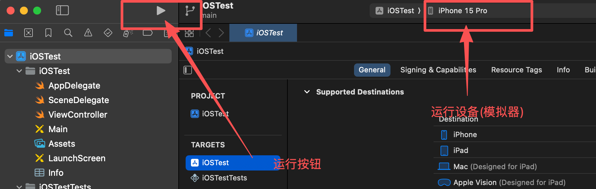
5. **安装 CocoaPods**（iOS 依赖管理，Flutter 构建 iOS 必需）：[建议开启VPN,减少失败]
   ```bash
   sudo gem install cocoapods
   ```

   安装完成后，输入 pod --version 验证是否安装成功。
   ```bash
   pod --version
   ```
   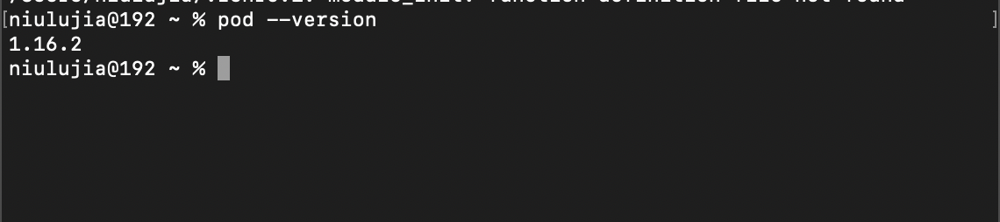
   若本机无 Ruby 或报错，可先通过 [Homebrew](https://brew.sh/) 安装 Ruby 再执行上述命令。首次在项目 `ios` 目录执行 `pod install` 时，CocoaPods 会下载索引，可能较慢。

---

## 三、Flutter SDK（鸿蒙版）

**本节说明**：安装鸿蒙 Flutter SDK 并加入 PATH，

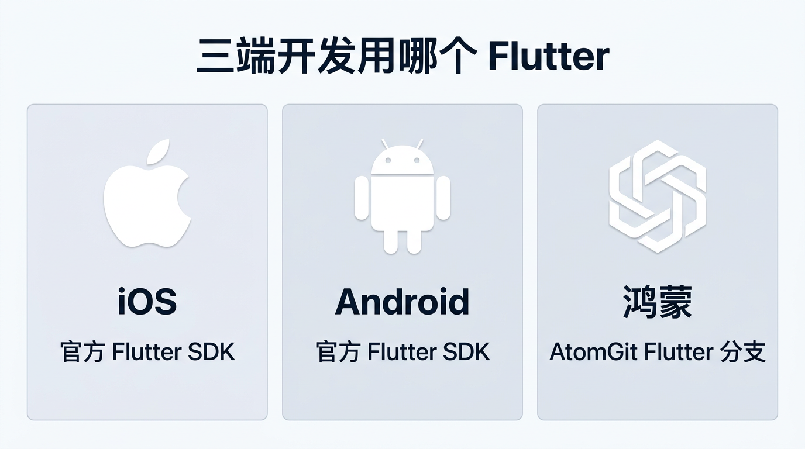

*图 2：iOS / Android 用官方 Flutter；鸿蒙需用 AtomGit 上的 Flutter 分支，不要混用。*

> 若需**同时支持鸿蒙**，可使用 [六、鸿蒙（OpenHarmony）环境](#六鸿蒙openharmony环境) 中的 Flutter 仓库（AtomGit 分支 `oh-3.35.7-dev`），与本节二选一或分目录安装、按需切换 `PATH`。

### 方式一：使用 Git

```bash
cd ~
git clone https://gitcode.com/openharmony-tpc/flutter_flutter.git
```

### 配置环境变量 PATH

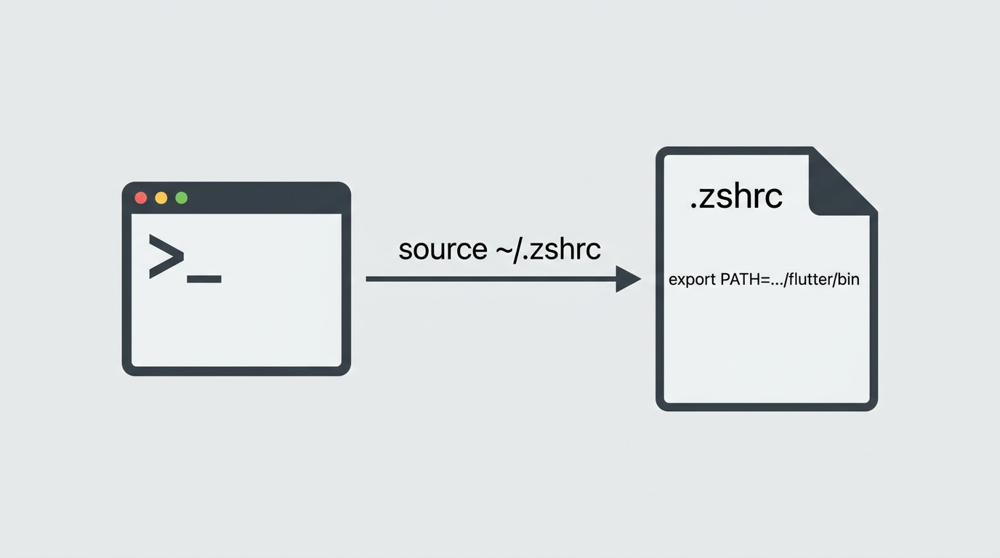

```bash
echo 'export PATH="$HOME/flutter_flutter/bin:$PATH"' >> ~/.zshrc
source ~/.zshrc
flutter --version
```

验证：

```bash
flutter --version
```
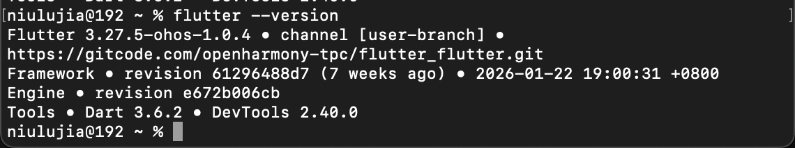
---

## 四、运行 Flutter Doctor

**本节说明**：用一条命令检查环境是否就绪，并按提示补全缺失项。

```bash
flutter doctor
```

**结果长什么样**：通过项会显示 ✅，有问题会显示 ❌ 或 ⚠️ 并提示怎么修（例如运行 `flutter doctor --android-licenses`）。


*图 4：只要Xcode 部分显示 ✅就表示flutterr安装成功,其他的若有 ❌，先不管。*

## 如果是官方版本的 Flutter 此时已经可以创建应用了、但是该版本安装的是鸿蒙版本,需要安装必要的鸿蒙的开发环境


---

## 五、鸿蒙（OpenHarmony）环境

**下载**： 鸿蒙 SDK 与工具链
前往浏览器下载(https://developer.huawei.com/consumer/cn/deveco-studio/)

注意区分芯片类型

1、DevEco Studio
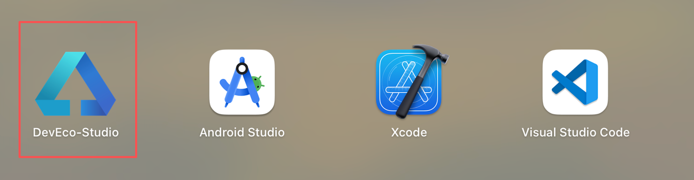
2、Command Line Tools
3、ohpm-repo

下载完成这三项之后,flutter 找不到 HMOS/OpenHarmony SDK，需要你在 macOS 上把 SDK 路径告诉它（环境变量 HOS_SDK_HOME 或 flutter config --ohos-sdk）。

### 5.1 设置path 编辑~/.zshrc


#  ⚠️OpenHarmony/HarmonyOS toolchain (from ~/Documents/command-line-tools)
export COMMAND_LINE_TOOLS_HOME="$HOME/Documents/command-line-tools"
export HOS_SDK_HOME="$COMMAND_LINE_TOOLS_HOME/sdk"

#  ⚠️ohpm / hvigor (optional but commonly needed)
export PATH="$COMMAND_LINE_TOOLS_HOME/bin:$COMMAND_LINE_TOOLS_HOME/ohpm/bin:$COMMAND_LINE_TOOLS_HOME/hvigor/bin:$PATH"
alias hvigor="$HOME/Documents/command-line-tools/bin/hvigorw"


### 5.2 环境检查与构建

```bash
flutter doctor -v
```

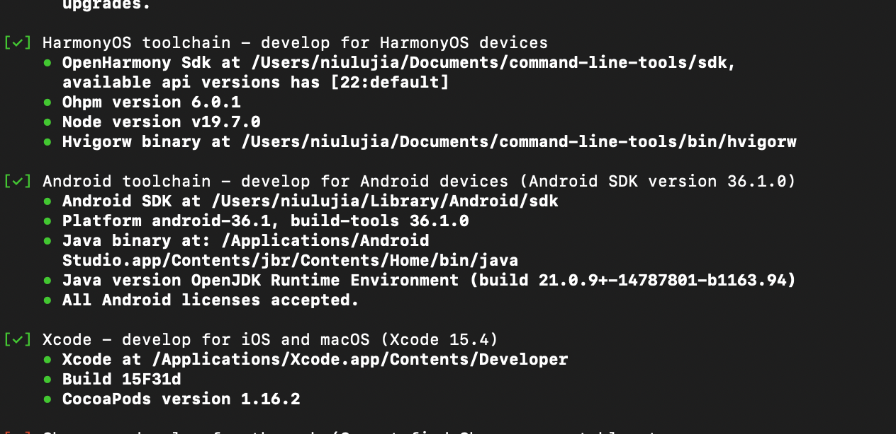

创建支持鸿蒙的工程：

```bash
flutter create appbyflutter
```
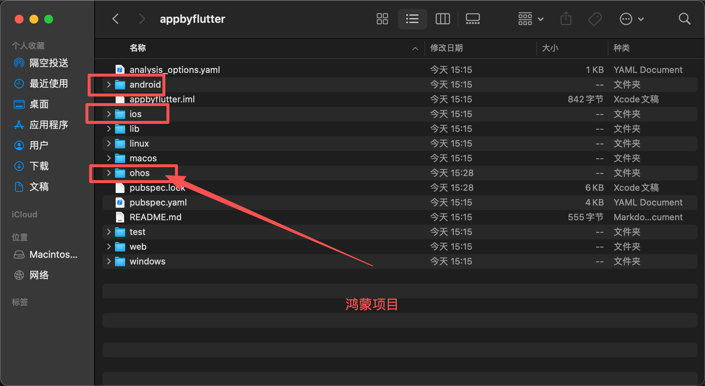


⚠️⚠️⚠️仅创建 iOS、Android、鸿蒙 的工程

```bash
flutter create --platforms ios,android,ohos appbyflutter
```

### 5.3 配置调试签名

1、启动DevEco
2、打开appbyflutter中的ohos项目
3、请通过DevEco Studio打开ohos工程后配置调试签名(File -> Project Structure -> Signing Configs 勾选Automatically
generate signature)

---
## 六、Android 环境（可选）
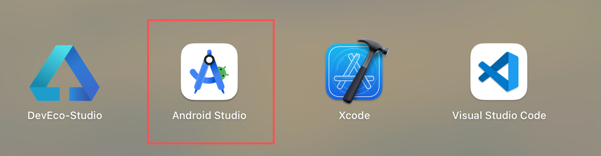
**本节说明**：仅在需要开发 Android 应用时配置；需 JDK 17 与 Android Studio。

若需在 Mac 上同时开发 Android：

1. **安装 JDK**  
   Flutter 构建 Android 需要 JDK，建议使用 **JDK 17**（与当前 Flutter 默认 Gradle 8.x 兼容）。  
   - 安装 [Android Studio](https://developer.android.com/studio) 时会自带 JDK，一般无需单独安装。  
   - 若使用独立 JDK 或多版本共存，可指定 Flutter 使用的 JDK 路径：  
     `flutter config --jdk-dir=/path/to/jdk`
2. 安装 [Android Studio](https://developer.android.com/studio)。
3. 再次运行 `flutter doctor` 确认 Android 项通过。

---

## 七、IDE 配置

**本节说明**：选 VS Code 或 Android Studio 其一，安装 Flutter 插件即可编写、运行、调试。

### 7.1 VS Code（轻量推荐）
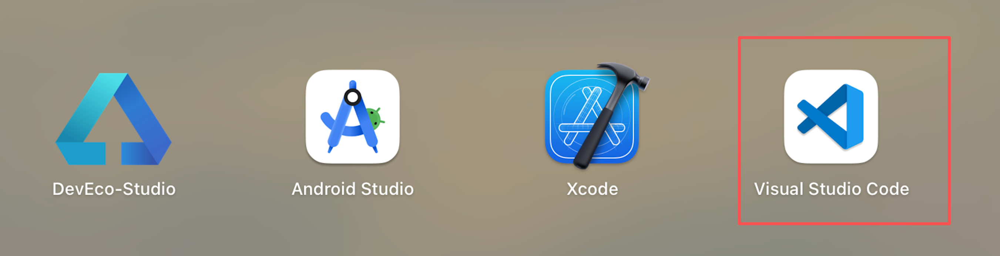
1. 安装 [VS Code](https://code.visualstudio.com/)。
2. 安装扩展：
   - **Flutter**（会连带安装 Dart 扩展）。
3. 命令面板（`Cmd+Shift+P`）输入 `Flutter: New Project` 可创建新项目；底部状态栏可选择设备并运行/调试。

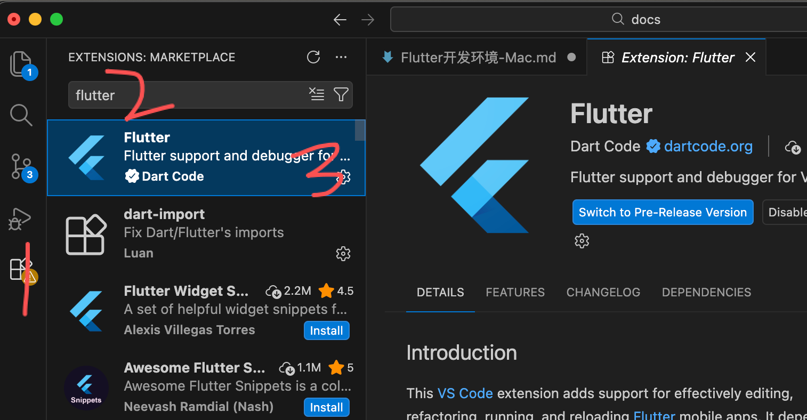

### 7.2 Android Studio
1. **Preferences / Settings** → **Plugins** → 搜索并安装 **Flutter**（会提示安装 Dart 插件）。
2. 重启后可通过 **New Flutter Project** 创建项目，并可使用内置模拟器与真机调试。

---

## 八、常用命令速查

**本节说明**：日常开发与鸿蒙构建的常用命令一览。

| 命令 | 说明 |
|------|------|
| `flutter doctor` | 检查开发环境 |
| `flutter create 项目名` | 创建新项目 |
| `flutter pub get` | 安装依赖 |
| `flutter run` | 运行当前项目（需连接设备或启动模拟器） |
| `flutter devices` | 列出可用设备/模拟器 |
| `flutter clean` | 清理构建缓存 |
| **iOS 打包** | |
| `flutter build ios` | 构建 iOS（debug/release，需加 `--release` 为正式包） |
| `flutter build ipa` | 构建 iOS 的 IPA（用于上架 App Store，需 Xcode 与签名） |
| **Android 打包** | |
| `flutter build apk` | 构建 Android APK（默认 release；加 `--debug` 为调试包） |
| `flutter build appbundle` | 构建 Android App Bundle（AAB，用于上架 Google Play） |
| **鸿蒙打包** | |
| `flutter create --platforms ohos 项目名` | 创建带鸿蒙平台的项目（需鸿蒙版 Flutter） |
| `flutter build hap --target-platform ohos-arm64 --debug` | 构建鸿蒙 debug HAP |
| `flutter build hap --target-platform ohos-arm64 --release` | 构建鸿蒙 release HAP（发布用） |

**8.1**：iOS运行与打包
1、flutter pub get
2、cd ios
3、flutter run


🍎运行到手机或者额打包需要配置开发者证书配置Xcode🍎

**8.2**：android运行与打包
1、flutter run
2、flutter build apk
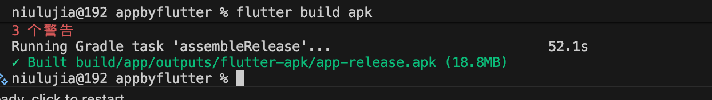

**8.3**：鸿蒙运行与打包
1、flutter run
2、flutter build hap(推荐通过鸿蒙开发者工具Build打包)
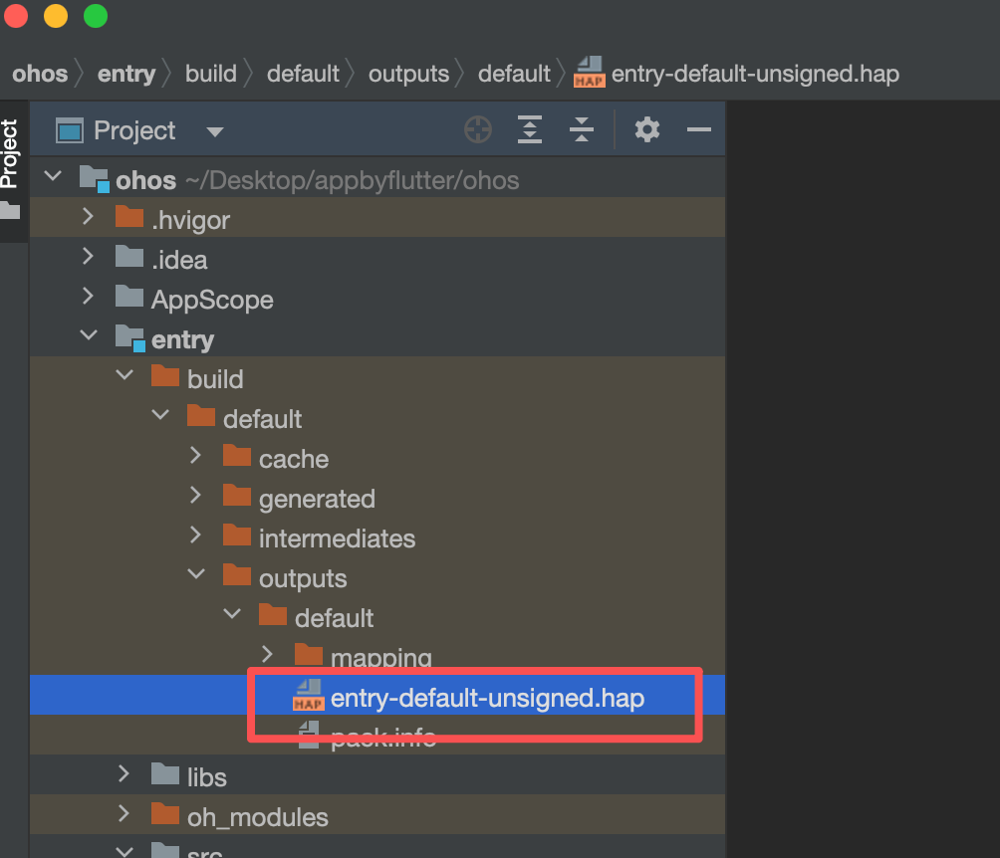
---

## 九、自检清单

**本节说明**：上架或开发前可逐项勾选，避免遗漏。

- [ ] Xcode 已安装并打开过一次；**若上架 App Store**：Xcode 版本 ≥ 16
- [ ] `xcode-select` 已指向正确 Xcode
- [ ] **CocoaPods** 已安装（`gem list cocoapods` 可验证）
- [ ] Flutter SDK 已解压/克隆并加入 `PATH`（鸿蒙需用 AtomGit 分支见第六节）
- [ ] `flutter --version` 能正常输出版本
- [ ] `flutter doctor` 中需要的项均为 ✅
- [ ] 若开发 **Android**：JDK 17 已可用（Android Studio 自带或 `flutter config --jdk-dir`）
- [ ] 若开发 **鸿蒙**：已配置 DevEco/CLI、环境变量，且 `flutter doctor` 显示 OpenHarmony 正常
- [ ] 已安装 VS Code 或 Android Studio 的 Flutter 插件
- [ ] 至少有一个可用设备（模拟器或真机）供 `flutter run`

---

## 十、常见问题

**本节说明**：常见报错与对应处理方式。

### 10.1 `flutter: command not found`

- 确认 Flutter 的 `bin` 目录已加入 `PATH`，且已 `source` 对应配置文件。
- 新开一个终端窗口再试。

### 10.2 Xcode 未同意许可

- 运行：`sudo xcodebuild -license accept`。

### 10.3 CocoaPods 相关错误（iOS）

- iOS 构建依赖 CocoaPods，安装见 [二、安装 Xcode](#二安装-xcode开发-ios-必备) 第 5 步。
- 在项目 `ios` 目录执行：`pod install`。首次运行会下载索引，可能较慢。

### 10.4 模拟器无法识别

- Xcode：**Window → Devices and Simulators** 中确认模拟器已下载。
- Android：Android Studio → **Device Manager** 中创建/启动 AVD。

### 10.5 国内网络慢或超时

- 可配置 Flutter 国内镜像（需自行查找当前可用的镜像地址），在 `~/.zshrc` 或 `~/.bash_profile` 中设置：
  ```bash
  export PUB_HOSTED_URL=...
  export FLUTTER_STORAGE_BASE_URL=...
  ```
  设置后重新 `source` 并执行 `flutter doctor`。

### 10.6 鸿蒙开发：Flutter 从哪里获取？doctor 不识别 OpenHarmony？

- 鸿蒙需使用 **AtomGit** 上的 Flutter 仓库，分支 **`oh-3.35.7-dev`**，见 [六、鸿蒙（OpenHarmony）开发环境](#六鸿蒙openharmony开发环境)。不要使用官网或 GitHub 的 Flutter 做鸿蒙构建。
- 确保 `PATH` 中优先使用鸿蒙版 Flutter 的 `bin` 目录，并配置好 `DEVECO_SDK_HOME`、`ohpm`、`hvigor` 等环境变量后，再运行 `flutter doctor -v` 查看 OpenHarmony 是否识别。

---

按上述步骤在 Mac 上完成配置后，即可使用 `flutter create`、`flutter run` 和 IDE 进行 Flutter 开发。本仓库为 Flutter 项目（含鸿蒙 ohos 平台），在环境就绪后可直接在项目根目录执行 `flutter pub get` 与 `flutter run` 运行应用；鸿蒙端使用 `flutter build hap` 构建。
