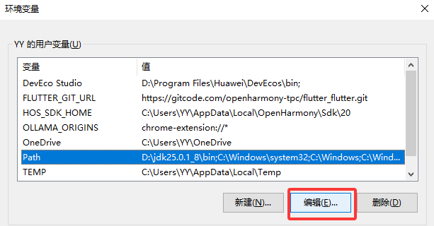
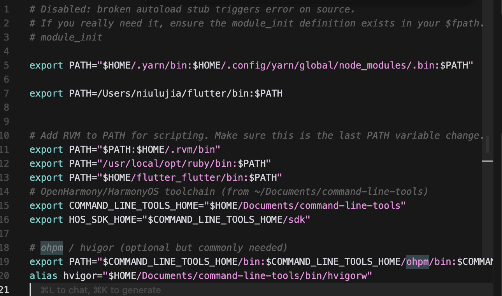
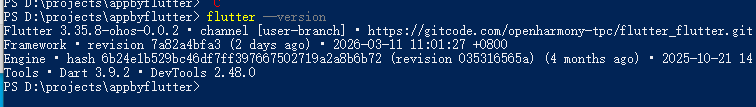
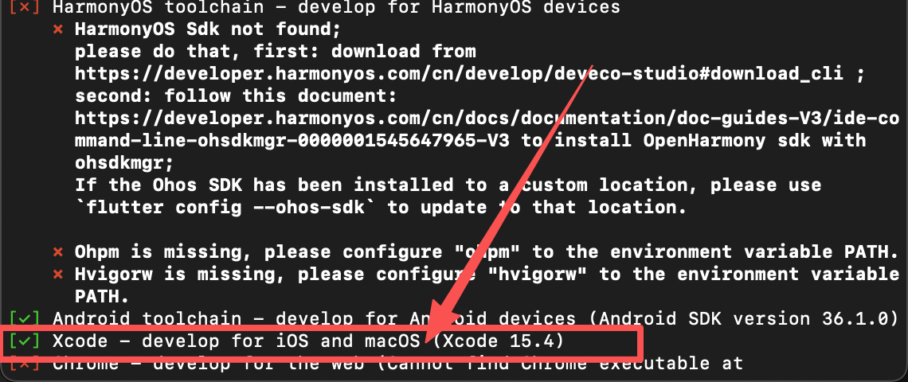
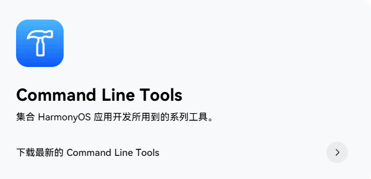
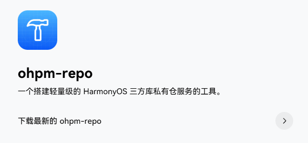
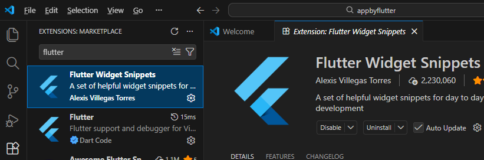
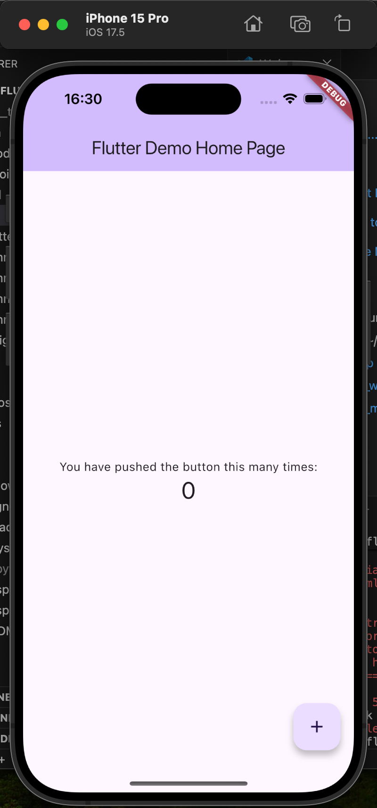

# Flutter 开发环境搭建指南（Windows）

以 Windows 为例，从零搭建 Flutter 开发环境的完整步骤。**说明**：Windows 不支持 iOS 开发，本文仅覆盖 **Android、鸿蒙** 双端。

**整体流程**（按顺序做，不容易乱）：


---

## 目录

| 章节 | 内容概要 |
|------|----------|
| [一、系统要求](#一系统要求) | Windows 版本、磁盘、基础工具 |
| [二、Flutter SDK（鸿蒙版）](#二flutter-sdk鸿蒙版) | 下载/克隆、配置 PATH、验证 |
| [三、运行 Flutter Doctor](#三运行-flutter-doctor) | 环境自检与修复建议 |
| [四、鸿蒙（OpenHarmony）环境](#四鸿蒙openharmony环境) | 鸿蒙版 Flutter（AtomGit）、DevEco、构建 HAP |
| [五、Android 环境（可选）](#五android-环境可选) | JDK 17、Android Studio、SDK、许可 |
| [六、IDE 配置](#六ide-配置) | VS Code / Android Studio 与 Flutter 插件 |
| [七、常用命令&项目运行](#七常用命令速查) | doctor、run、build、鸿蒙 HAP 等 |
| [八、自检清单](#八自检清单) | 开发前逐项核对 |
| [九、常见问题](#九常见问题) | 报错与排查 |

---

## 一、系统要求

**本节说明**：确认 Windows 满足最低要求后再进行后续安装。

---

- **操作系统**：Windows 10 或更高（建议 Windows 10 64 位 20H2+，或 Windows 11）
- **磁盘空间**：本文档覆盖 **Android、鸿蒙** 双端开发，建议预留 **50 GB 以上**。Android Studio、DevEco、各端 SDK 与模拟器/镜像、构建缓存等会持续占用空间。
- **工具**：需安装 [Git for Windows](https://git-scm.com/download/win)（用于克隆 Flutter 仓库）；PowerShell 或 CMD 为系统自带。

---

## 二、Flutter SDK（鸿蒙版）

**本节说明**：安装鸿蒙 Flutter SDK 并加入 PATH。


*图：Android 可用官方 Flutter；鸿蒙需用 AtomGit 上的 Flutter 分支，不要混用。*

> 若需**同时支持鸿蒙**，可使用 [四、鸿蒙（OpenHarmony）环境](#四鸿蒙openharmony环境) 中的 Flutter 仓库（AtomGit 分支 `oh-3.35.7-dev`），与本节二选一或分目录安装、按需切换 `PATH`。

### 方式一：使用 Git

在 **PowerShell** 或 **CMD** 中执行（将 `C:\src` 换成你希望放置的目录）：

```powershell
git clone https://gitcode.com/openharmony-tpc/flutter_flutter.git
```
### 方式一：直接下载zip然后解压

下载地址:
https://atomgit.com/openharmony-tpc/flutter_flutter/tree/oh-3.35.7-dev

### 配置环境变量 PATH（Windows）


**方法：图形界面**

1. 右键 **此电脑** → **属性** → **高级系统设置** → **环境变量**。
2. 在 **用户变量** 中选中 **Path** → **编辑** → **新建**，



添加：

`%USERPROFILE%\flutter_flutter\bin`（若克隆到其他目录则填该目录下的 `bin` 路径）。

添加结果：




3. 确定保存后，**重新打开** PowerShell 或 CMD。

然后**新开一个终端**再执行：

```powershell
flutter --version
```

验证：



---

## 三、运行 Flutter Doctor

**本节说明**：用一条命令检查环境是否就绪，并按提示补全缺失项。

```powershell
flutter doctor
```

**结果长什么样**：通过项会显示 ✅，有问题会显示 ❌ 或 ⚠️ 并提示怎么修（例如运行 `flutter doctor --android-licenses`）。



*图：Android / Flutter 等项显示 ✅ 即表示 Flutter 安装成功；若有 ❌ 可按提示逐项修复。*

本版本为鸿蒙版 Flutter，需继续配置鸿蒙开发环境后才能构建 HAP，见下一节。

---

## 四、鸿蒙（OpenHarmony）环境

**下载**： 鸿蒙 SDK 与工具链
前往浏览器下载(https://developer.huawei.com/consumer/cn/deveco-studio/)

注意区分芯片类型

1、DevEco Studio

2、Command Line Tools

3、ohpm-repo


下载完成这三项之后，Flutter 找不到 HMOS/OpenHarmony SDK，需在 Windows 上把 SDK 路径告诉它（环境变量 `HOS_SDK_HOME` 或 `flutter config --ohos-sdk`）。

### 4.1 设置环境变量（Windows）

将 **Command Line Tools** 解压到某目录（例如 `D:\huawei\command-line-tools`），然后添加系统/用户环境变量：


设置方式：**此电脑 → 属性 → 高级系统设置 → 环境变量 → 用户变量 → path** 中编辑。保存后**重新打开终端**。


### 4.2 环境检查与构建

在**新开的** PowerShell 或 CMD 中执行：

```powershell
flutter doctor -v
```


⚠️ 仅创建 **Android、鸿蒙** 的工程（Windows 无 iOS）：

```powershell
flutter create --platforms android,ohos appbyflutter
```


创建(不区分平台的)工程：

```powershell
flutter create appbyflutter
```
会创建全部平台的工程

### 4.3 配置调试签名

1、启动DevEco
2、打开appbyflutter中的ohos项目
3、请通过DevEco Studio打开ohos工程后配置调试签名(File -> Project Structure -> Signing Configs 勾选Automatically
generate signature)

---
## 五、Android 环境（可选）
**本节说明**：仅在需要开发 Android 应用时配置；需 JDK 17 与 Android Studio。

在 Windows 上开发 Android 时：

1. **安装 JDK**  
   Flutter 构建 Android 需要 JDK，建议使用 **JDK 17**（与当前 Flutter 默认 Gradle 8.x 兼容）。  
   - 安装 [Android Studio](https://developer.android.com/studio) 时会自带 JDK，一般无需单独安装。  
   - 若使用独立 JDK 或多版本共存，可指定 Flutter 使用的 JDK 路径，例如：  
     `flutter config --jdk-dir=C:\Program Files\Java\jdk-17`
2. 安装 [Android Studio](https://developer.android.com/studio)。
3. 再次运行 `flutter doctor` 确认 Android 项通过。

---

## 六、IDE 配置

**本节说明**：选 VS Code 或 Android Studio 其一，安装 Flutter 插件即可编写、运行、调试。

### 6.1 VS Code（轻量推荐）

1. 安装 [VS Code](https://code.visualstudio.com/)。
2. 安装扩展：
   - **Flutter**（会连带安装 Dart 扩展）。
3. 命令面板（**Ctrl+Shift+P**）输入 `Flutter: New Project` 可创建新项目；底部状态栏可选择设备并运行/调试。



### 6.2 Android Studio
1. **File → Settings**（或 **Ctrl+Alt+S**）→ **Plugins** → 搜索并安装 **Flutter**（会提示安装 Dart 插件）。
2. 重启后可通过 **New Flutter Project** 创建项目，并可使用内置模拟器与真机调试。

---

## 七、常用命令速查

**本节说明**：日常开发与鸿蒙构建的常用命令一览。

| 命令 | 说明 |
|------|------|
| `flutter doctor` | 检查开发环境 |
| `flutter create 项目名` | 创建新项目 |
| `flutter pub get` | 安装依赖 |
| `flutter run` | 运行当前项目（需连接设备或启动模拟器） |
| `flutter devices` | 列出可用设备/模拟器 |
| `flutter clean` | 清理构建缓存 |
| **Android 打包** | |
| `flutter build apk` | 构建 Android APK（默认 release；加 `--debug` 为调试包） |
| `flutter build appbundle` | 构建 Android App Bundle（AAB，用于上架 Google Play） |
| **鸿蒙打包** | |
| `flutter create --platforms ohos 项目名` | 创建带鸿蒙平台的项目（需鸿蒙版 Flutter） |
| `flutter build hap --target-platform ohos-arm64 --debug` | 构建鸿蒙 debug HAP |
| `flutter build hap --target-platform ohos-arm64 --release` | 构建鸿蒙 release HAP（发布用） |


**7.1**：Android 运行与打包
1. `flutter pub get`（可选，首次或依赖变更时）
2. `flutter run`（选择 Android 设备/模拟器）
3. `flutter build apk`（打包 APK）

**7.2**：鸿蒙运行与打包
1、flutter run
2、flutter build hap(推荐通过鸿蒙开发者工具Build打包)



---

## 八、自检清单

**本节说明**：开发前可逐项勾选，避免遗漏。

- [ ] Flutter SDK 已克隆并加入 **PATH**（鸿蒙版见 [二、Flutter SDK](#二flutter-sdk鸿蒙版)）
- [ ] `flutter --version` 能正常输出版本
- [ ] `flutter doctor` 中需要的项均为 ✅
- [ ] 若开发 **Android**：JDK 17 已可用（Android Studio 自带或 `flutter config --jdk-dir`）
- [ ] 若开发 **鸿蒙**：已配置 DevEco/CLI、环境变量 `HOS_SDK_HOME` 等，且 `flutter doctor` 显示 OpenHarmony 正常（见 [四、鸿蒙环境](#四鸿蒙openharmony环境)）
- [ ] 已安装 VS Code 或 Android Studio 的 Flutter 插件
- [ ] 至少有一个可用设备（模拟器或真机）供 `flutter run`

---

## 九、常见问题

**本节说明**：常见报错与对应处理方式。

### 9.1 `flutter: 不是内部或外部命令` / `command not found`

- 确认 Flutter 的 `bin` 目录已加入系统/用户 **PATH**（见 [二、Flutter SDK](#二flutter-sdk鸿蒙版)）。
- 修改环境变量后务必**重新打开** PowerShell 或 CMD 再试。

### 9.2 模拟器无法识别

- **Android**：Android Studio → **Device Manager** 中创建并启动 AVD。

### 9.3 国内网络慢或超时

- 可配置 Flutter 国内镜像（需自行查找当前可用的镜像地址）。在 **系统环境变量** 中新建用户变量，例如：
  - `PUB_HOSTED_URL` = `https://pub.flutter-io.cn`
  - `FLUTTER_STORAGE_BASE_URL` = `https://storage.flutter-io.cn`
  设置后重新打开终端并执行 `flutter doctor`。（具体镜像地址请以当前可用为准。）

### 9.4 鸿蒙开发：Flutter 从哪里获取？doctor 不识别 OpenHarmony？

- 鸿蒙需使用 **AtomGit** 上的 Flutter 仓库，分支 **`oh-3.35.7-dev`**，见 [四、鸿蒙（OpenHarmony）环境](#四鸿蒙openharmony环境)。不要使用官网或 GitHub 的 Flutter 做鸿蒙构建。
- 确保 `PATH` 中优先使用鸿蒙版 Flutter 的 `bin` 目录，并配置好 `HOS_SDK_HOME`、`COMMAND_LINE_TOOLS_HOME`、`ohpm`、`hvigor` 等环境变量后，再运行 `flutter doctor -v` 查看 OpenHarmony 是否识别。

---

按上述步骤在 Windows 上完成配置后，即可使用 `flutter create`、`flutter run` 和 IDE 进行 Flutter 开发。本仓库为 Flutter 项目（含鸿蒙 ohos 平台），在环境就绪后可直接在项目根目录执行 `flutter pub get` 与 `flutter run` 运行应用；鸿蒙端使用 `flutter build hap` 构建。
